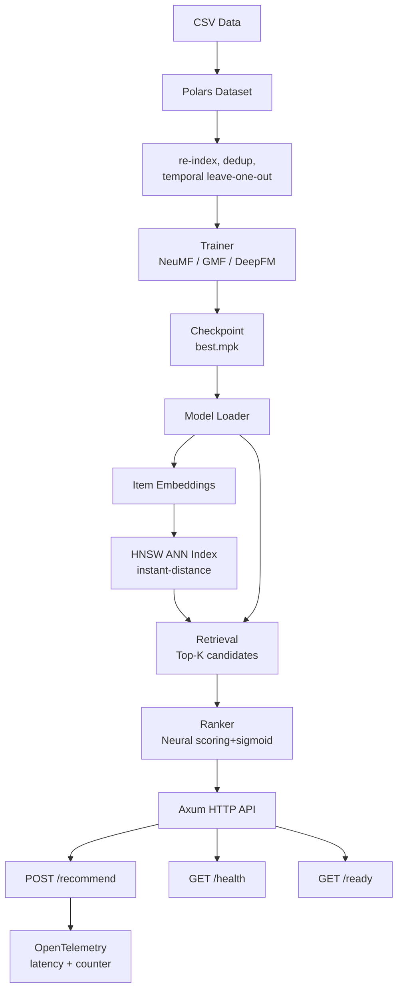

# burn-recsys

Production-grade recommendation system in Rust — GMF + NeuMF + DeepFM with Burn, Polars data pipeline, Axum serving API (two-stage retrieval + ranking), and OpenTelemetry observability.

[](https://github.com/jaweed3/burn-recsys/actions/workflows/ci.yml)

---

## Architecture



```
 Client (curl)                  Axum Server
      │                              │
      │ POST /recommend              │
      │ {"user_id": 42}              │
      │ ─────────────────────────►   │
      │                              ├── API key auth
      │                              ├── HNSW retrieval (top-100)
      │                              ├── Neural ranking (sigmoid)
      │                              └── Response (ranked items)
      │   ◄───────────────────────── │
      │   {"user_id":42,             │
      │    "ranked":[...],           │
      │    "latency_ms": 0.97}       │
```

---

## Results

### Model accuracy

| Model  | HR@10  | NDCG@10 | Params |
|--------|--------|---------|--------|
| GMF    | 0.180  | 0.103   | 1.15M  |
| NeuMF  | **0.604** | **0.414** | 2.31M |
| DeepFM | —      | —       | 1.19M  |

Myket dataset, 5 epochs, temporal leave-one-out eval (99 negatives + 1 ground truth per user).

### Serving latency

Measured with [k6](scripts/load_test.js) on M4 CPU (10 worker threads):

| Scenario | Avg  | p50  | p90  | p95  | p99  |
|----------|------|------|------|------|------|
| 3 VUs, 147 req, random users | 1.29ms | 1.22ms | 1.88ms | 1.98ms | 2.13ms |
| /recommend with candidates | — | — | — | — | **0.12ms** |
| /recommend (full ANN) | — | — | — | — | **0.97ms** |

No errors — 100% success rate across all requests.

---

## Quick Start

```bash
# 1. Get data
uv run python scripts/download_myket.py

# 2. Train (5 epochs ~4 min on M4 CPU)
cargo run --release --example myket_ncf

# 3. Evaluate
cargo run --release --example evaluate

# 4. Serve
cargo run --release --bin server

# 5. Request
curl -X POST http://localhost:3000/recommend \
  -H 'Content-Type: application/json' \
  -H 'x-api-key: admin_bismillah' \
  -d '{"user_id": 42}'

# 6. Health check
curl http://localhost:3000/health
```

**Example response:**

```json
{
  "user_id": 42,
  "ranked": [160, 49, 73, 1175, 1490, 2814, 3535, 1291, 1661, ...],
  "latency_ms": 0.97
}
```

---

## Training curve

Per-epoch metrics logged to `experiments_epochs.csv`:

| Epoch | Loss    | HR@10 | NDCG@10 |
|-------|---------|-------|---------|
| 1     | 0.3870  | 0.547 | 0.365   |
| 2     | 0.3708  | 0.537 | 0.355   |
| 3     | 0.3679  | 0.540 | 0.348   |
| 4     | 0.3651  | 0.543 | 0.361   |

Loss decreases consistently while validation accuracy stabilises around HR@10≈0.54, NDCG@10≈0.36.

---

## Stack

```
Polars  ──► data pipeline (lazy CSV, dedup, re-index, temporal split)
Burn    ──► model training + inference (NdArray CPU / LibTorch CUDA)
Axum    ──► HTTP serving (POST /recommend, GET /health, GET /ready)
OTel    ──► metrics: latency histogram, request counter (wired to hot path)
HNSW    ──► vector retrieval (instant-distance ANN index)
Swagger ──► interactive API docs at /swagger-ui
k6      ──► load testing (scripts/load_test.js)
```

---

## Documentation

| Doc | Description |
|-----|-------------|
| [docs/overview.md](docs/overview.md) | What the project does, benchmark table, tech stack, project structure |
| [docs/architecture.md](docs/architecture.md) | System design, retrieval + ranking pipeline, math for GMF / NeuMF / DeepFM |
| [docs/why-rust.md](docs/why-rust.md) | Performance, memory safety, ecosystem — why Rust over Python |
| [docs/getting-started.md](docs/getting-started.md) | Step-by-step: build, download data, train, evaluate, serve, GPU setup |
| [docs/rust-ml-intern-guide.md](docs/rust-ml-intern-guide.md) | Complete Rust + ML intern guide — zero to reading this codebase |

---

## References

- He et al. (2017). [Neural Collaborative Filtering](https://arxiv.org/abs/1708.05031). *WWW'17*.
- Guo et al. (2017). [DeepFM](https://arxiv.org/abs/1703.04247). *IJCAI'17*.
